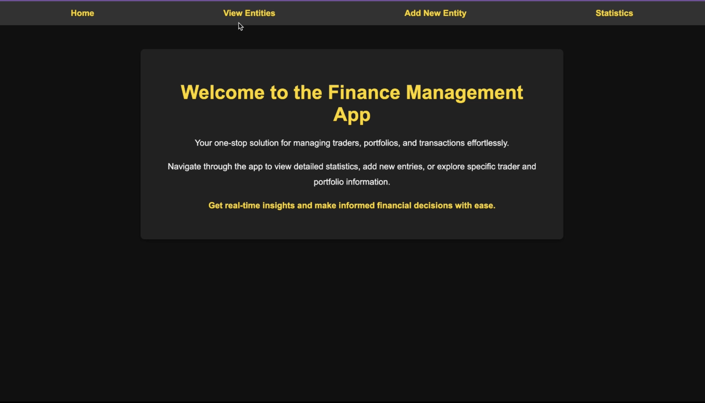
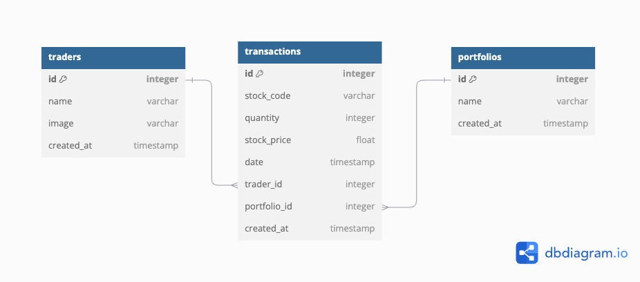

# Finance Management App

## Description
The Finance Management App is a full-stack application designed to streamline the management of traders, portfolios, and transactions within a finance-focused environment. This project provides a robust and user-friendly interface for viewing, adding, and managing financial entities. The app is ideal for a finance management company or a trading community looking to maintain organized and insightful data on trades, stock portfolios, and associated traders.


## Demo Video
[](https://youtu.be/FVIApOpCSdU)


The main purpose of the app is to centralize financial data, allowing users to track key statistics and view detailed information for each trader, portfolio, and transaction. With a structured layout and clear navigation, the app offers functionality that lets users explore detailed pages for each entity. It also provides a statistics section to visualize valuable financial insights such as top portfolios, active traders, and popular transactions.

Each section of the app is carefully designed for ease of use:
- The "Entity List" page allows users to toggle between traders, portfolios, and transactions, offering specific details and associated data for each.
- A dedicated "Statistics" page visualizes key financial metrics, helping users gain insights into portfolio values, trading activity, and stock performance.
- The app’s secure user login functionality ensures that only authenticated users can access and add new financial entities.

In developing this application, I focused on creating an intuitive user experience, keeping the features streamlined to avoid overwhelming users. Each functionality serves a specific purpose, and the design is crafted to meet the app's primary goal of effective financial data management.

## Project Structure

```
.
├── Pipfile
├── Pipfile.lock
├── README.md
├── client
│   ├── README.md
│   ├── client
│   ├── package-lock.json
│   ├── package.json
│   ├── public
│   └── src
├── data
│   ├── demovideo.mp4
│   └── thumbnail.png
├── package-lock.json
├── package.json
└── server
    ├── app.py
    ├── instance
    ├── migrations
    ├── models.py
    └── seed.py
```

## Database Diagram

The following diagram illustrates the structure of the Finance Management App database, showing the relationships between Traders, Portfolios, and Transactions.



## Features
- **View All Entities**: Easily navigate between lists of traders, portfolios, and transactions. Click on an entity to view its detailed information.
- **Add New Entities**: Users can add new traders, portfolios, or transactions via a simple, guided form.
- **Comprehensive Entity Pages**: Each trader, portfolio, and transaction has a dedicated page showing relevant details and associated information.
- **Statistics Dashboard**: Visualizes key financial data, including top-performing portfolios, active traders, and frequently traded stocks.
- **Delete Functionality**: Entities can be removed directly from their detail pages for seamless data management.

## Set-up
To get started with the Finance Management App:

1. **Clone the Repository**
   - Clone this repository to your local machine.

2. **Backend Setup (Python)**
   - Navigate to the server directory.
   - Install the required Python dependencies: `pipenv install`
   - Activate the virtual environment: `pipenv shell`
   - Set up the database: `python seed.py` (this will populate the database with sample data).
   - Run the backend server: `python app.py`

3. **Frontend Setup (JavaScript)**
   - Navigate to the root directory.
   - Install the required frontend dependencies: `npm install`
   - Start the frontend application: `npm start`

4. **Enjoy!**
   - Open the application in your browser (typically at http://localhost:3000 by default) and explore the Finance Management App!